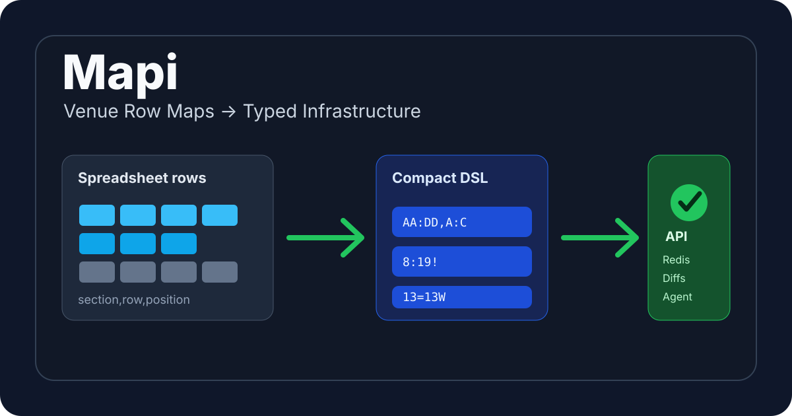

# Mapi

<p align="center">
  
</p>


Mapi is a FastAPI/Python case study for a ticketing infrastructure problem:
turning spreadsheet-shaped venue section-row maps into compact, validated,
diffable, cacheable infrastructure values.

The name is intentional: Mapi is a friendly name for a mapping API. It maps
venue maps, maps compact DSL values into normalized infrastructure values, and
exposes those mappings through an API.

The examples in this repository are synthetic. The project is intended as a
public engineering portfolio artifact, not a claim of production deployment.

## What Mapi Solves

Broker operations teams often maintain venue section-row maps manually in
spreadsheets. A section can contain repeated-letter rows, numeric rows, physical
gaps, and aliases that share a row position. Mapi turns that manual row-map
normalization workflow into deterministic, typed, testable API infrastructure.

```text
Manual spreadsheet row-map maintenance
        ↓
Mapi import/validation/compression
        ↓
Compact row progression source of truth
        ↓
Typed rows, stats, diffs, Redis records, and review triggers
```

## Broker Workflow This Replaces

Manual spreadsheet workflows usually mix source data, assumptions, and review
notes in one place. Mapi separates those concerns:

- Spreadsheet-shaped records become input.
- Compact row progression DSL becomes the source value.
- Expanded rows, stats, diffs, Redis records, and agent review guidance become
  deterministic derivatives.

## Before and After

| Layer | Manual workflow | Mapi workflow |
| --- | --- | --- |
| Manual spreadsheet rows | `101,AA,1`, `101,BB,2`, `101,13W,20` | Same shape accepted through CSV or API |
| Compact Mapi DSL | Hidden in spreadsheet conventions | `AA:DD,A:C,8:19!,13=13W` |
| Typed rows/API output | Recreated by each downstream tool | `RowOut(name="13W", position=20)` |
| Review workflow | Manual inspection | Parser stats, diffs, Redis fields, agent triggers |

This is not a fake CRUD app. It is a small domain model for a specific
ticketing operations problem.

## DSL Examples

```text
1:4                         -> 1, 2, 3, 4
5:1                         -> 5, 4, 3, 2, 1
A:D                         -> A, B, C, D
AA:DD                       -> AA, BB, CC, DD
A,B:C!,D                    -> A at position 1, D at position 4
1:2,3=3W                    -> 3 and 3W share position 3
DD:AA,A:C,1:4,5!,6:10:2    -> mixed descending, alpha, numeric, gap, stepped
```

See [docs/DOMAIN.md](docs/DOMAIN.md) for the parser rules.

## API Examples

Run locally:

```bash
python -m pip install -e ".[dev]"
uvicorn app.main:app --reload
```

Parse one section:

```bash
curl -X POST http://127.0.0.1:8000/api/v1/row-progression/parse \
  -H 'content-type: application/json' \
  -d '{"code":"AA:DD,A:C,8:19!,13=13W"}'
```

Compress typed rows:

```bash
curl -X POST http://127.0.0.1:8000/api/v1/row-progression/compress \
  -H 'content-type: application/json' \
  -d '{
    "code": "manual",
    "rows": [
      {"name": "A", "position": 3},
      {"name": "B", "position": 5},
      {"name": "BW", "position": 5}
    ]
  }'
```

Response:

```json
{"code": "1:2!,A,4!,B=BW"}
```

All domain endpoints live under `/api/v1/row-progression`. OpenAPI docs are
available at `/docs` when the app is running.

## CSV Import Demo

Run the local import command:

```bash
python -m app.cli import-csv examples/csv/demo_venue_rows.csv
```

Expected output:

```json
{
  "sections": {
    "101": "AA:DD,A:C,8:19!,13=13W",
    "102": "A,2:3!,D"
  }
}
```

The same workflow is exposed through the API:

```bash
curl -X POST http://127.0.0.1:8000/api/v1/row-progression/import-rows \
  -H 'content-type: application/json' \
  -d '{
    "rows": [
      {"section": "101", "row": "AA", "position": 1},
      {"section": "101", "row": "BB", "position": 2},
      {"section": "101", "row": "13", "position": 20},
      {"section": "101", "row": "13W", "position": 20}
    ]
  }'
```

## Pydantic AI Agent

Mapi includes a keyless Pydantic AI agent endpoint for explaining what a compact
row progression means and how it should flow through Redis and review systems.
The default model is a local `FunctionModel`, so tests and demos do not require
external credentials.

```bash
curl -X POST http://127.0.0.1:8000/api/v1/row-progression/agent/analyze \
  -H 'content-type: application/json' \
  -d '{
    "venue_id": "demo-arena",
    "section_id": "101",
    "code": "AA:DD,A:C,8:19!,13=13W",
    "question": "What should a broker review before publishing?"
  }'
```

The response includes parser-grounded rows and stats, a friendly explanation of
the Mapi name, Redis key suggestions, review triggers, and recommended next
actions.

## Ticketmaster Discovery + Maps Enrichment

Mapi can optionally ingest Ticketmaster Discovery Feed 2.0 event metadata,
extract `legacyEventId` values, and use those IDs to request
Ticketmaster-served place-detail metadata. This extends Mapi beyond manually
maintained spreadsheet-shaped row maps into provider-backed venue-map
enrichment.

The integration is provider-backed, fixture-tested, and documented as a
production extension path. Secrets are read from environment settings and are
never committed.

Mapi demonstrates how broker-created spreadsheet maps and provider-served
event/venue metadata can be normalized behind the same typed API boundary.

## Redis Usage

The compact code can be stored as a Redis string:

```redis
SET venue:demo-arena:section:101:row_progression "AA:DD,A:C,8:19!,13=13W"
```

It can also live in a section hash:

```redis
HSET venue:demo-arena:section:101 \
  row_progression "AA:DD,A:C,8:19!,13=13W" \
  parser_version "0.1.0" \
  row_count "9"
```

Expanded rows can be cached as Redis JSON for agent workflows. Venue diffs can
trigger downstream marketplace or inventory review workflows: row-count changes,
new aliases, removed rows, or suspicious gaps become auditable review events.
See [docs/REDIS_MODEL.md](docs/REDIS_MODEL.md).

## Architecture


Key files:

- `app/services/spreadsheet_import.py`: CSV/API import normalization.
- `app/schemas/validators.py`: parser, compressor, stats, venue build, venue
  diff.
- `app/agents/mapi.py`: Pydantic AI agent wrapper for mapping analysis.
- `app/api/v1/endpoints/progression.py`: versioned FastAPI endpoints.
- `docs/ARCHITECTURE.md`: architecture notes and parser flow.
- `app/schemas/*.py`: Pydantic request and response models.

## Testing Strategy

The suite covers:

- Numeric, single-letter, and multi-letter repeated-letter ranges.
- Ascending, descending, and stepped ranges.
- Mixed atomic row codes.
- Equivalent rows with `=`.
- Gap rows with `!`.
- Duplicate row detection.
- Spreadsheet-shaped import validation.
- `parse -> compress -> parse` round trips.
- Pydantic AI agent analysis without external model credentials.
- API and CLI response contracts.

Run:

```bash
black --check .
isort --check-only .
ruff check .
mypy app
pytest --cov=app --cov-report=term-missing
```

## Local Development

Python 3.13 is retained because the current FastAPI, Pydantic, and Pydantic AI
dependency set supports it.

```bash
python3.13 -m venv .venv
source .venv/bin/activate
python -m pip install --upgrade pip
python -m pip install -e ".[dev]"
make quality
make demo-cli
uvicorn app.main:app --reload
```

Docker is also available for API and Redis Stack demos:

```bash
docker compose up --build
```

## Portfolio Case Study

Mapi demonstrates backend architecture, parser correctness, typed FastAPI
contracts, property-based testing, Redis-oriented modeling, deterministic
Pydantic AI agent integration, and a broker workflow import path around a real
class of ticketing data problem.

Suggested repository description:

```text
Ticketing venue row-map parser, validator, diff engine, and review workflow API.
```

Suggested topics:

```text
python fastapi pydantic-v2 ticketing domain-modeling dsl parser redis portfolio-project
```

## More Documentation

- [docs/PORTFOLIO_CASE_STUDY.md](docs/PORTFOLIO_CASE_STUDY.md)
- [docs/BROKER_WORKFLOW.md](docs/BROKER_WORKFLOW.md)
- [docs/DEMO.md](docs/DEMO.md)
- [docs/PRODUCTION_EXTENSIONS.md](docs/PRODUCTION_EXTENSIONS.md)
- [docs/TICKETMASTER_DISCOVERY_FEED.md](docs/TICKETMASTER_DISCOVERY_FEED.md)
- [docs/TICKETMASTER_MAPS.md](docs/TICKETMASTER_MAPS.md)
- [docs/TICKETMASTER_ENRICHMENT_PIPELINE.md](docs/TICKETMASTER_ENRICHMENT_PIPELINE.md)
- [docs/DOMAIN.md](docs/DOMAIN.md)
- [docs/ARCHITECTURE.md](docs/ARCHITECTURE.md)
- [docs/REDIS_MODEL.md](docs/REDIS_MODEL.md)
- [docs/EXAMPLES.md](docs/EXAMPLES.md)
