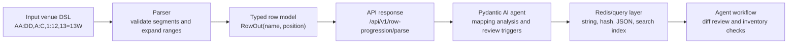

# Architecture

Mapi is intentionally small: the interesting work is the domain parser, not a
large service framework. FastAPI exposes the parser through versioned endpoints,
Pydantic models define request and response contracts, and pure Python helpers
keep parse/compress/diff behavior testable without an ASGI server.

Mapi also includes a Pydantic AI agent layer. The agent interprets a compact row
progression as a mapping value: the same string can represent a venue map, a
normalized infrastructure value, and an API payload.



## Runtime Modules

| Module                                     | Responsibility                                                                  |
| ------------------------------------------ | ------------------------------------------------------------------------------- |
| `src/mapi/schemas/validators.py`           | Parse, compress, inspect, build, and diff row progression codes.                |
| `src/mapi/agents/mapi.py`                  | Pydantic AI agent that explains mapping value, Redis keys, and review triggers. |
| `src/mapi/schemas/*.py`                    | Pydantic request and response models for API contracts.                         |
| `src/mapi/api/v1/endpoints/progression.py` | Versioned FastAPI endpoints under `/api/v1/row-progression`.                    |
| `src/mapi/main.py`                         | FastAPI app construction, middleware, and health/cache endpoints.               |
| `docs/*.md`                                | Domain, architecture, Redis, and example documentation.                         |

## Endpoint Surface

All domain endpoints are versioned under `/api/v1/row-progression`.

| Method | Path             | Purpose                                                          |
| ------ | ---------------- | ---------------------------------------------------------------- |
| `POST` | `/parse`         | Expand one compact code into typed rows.                         |
| `POST` | `/bulk-parse`    | Parse several compact codes independently.                       |
| `POST` | `/compress`      | Canonicalize expanded rows back into a compact code.             |
| `POST` | `/stats`         | Return row counts, unique positions, entropy, and segment count. |
| `POST` | `/build-venue`   | Expand a venue made of compact section definitions.              |
| `POST` | `/venue-diff`    | Compare compact venue maps by section and row position.          |
| `POST` | `/agent/analyze` | Run the Mapi Pydantic AI agent on one compact section code.      |

## Parser Flow

1. Split the code on commas and reject empty segments.
2. Detect and remove trailing `!` gap markers.
3. Parse `=` aliases as multiple row names sharing one position.
4. Parse `:` ranges only when both ends are numeric or repeated-letter codes in
   the same family.
5. Advance physical position for every atomic, alias, range member, and gap.
6. Return only non-gap rows and reject duplicate returned row names.

## Compression Flow

Compression is canonical rather than lossless. It preserves the parsed meaning,
not the exact source text.

For example:

```text
DD:AA,A:C,1:4,5!,6:10:2,12=12W,ZZZ
```

compresses to:

```text
DD:AA,A:C,1:4,12!,6:10:2,12=12W,ZZZ
```

Both parse to the same typed rows. The gap label changes because gaps are
position-only in the returned model.

## Why FastAPI

FastAPI keeps the project easy to inspect:

- Pydantic schemas become OpenAPI request and response models.
- Endpoint behavior can be tested with `TestClient`.
- The parser remains framework-independent and property-testable.
- The API can be embedded behind other marketplace, broker, or data-quality
  systems without changing the DSL.

## Why Pydantic AI

The Pydantic AI agent gives the project an explicit agent workflow without
making tests depend on a live model provider. The default model is a local
`FunctionModel` that returns deterministic, parser-grounded analysis.

This keeps the agent honest:

- Parser output remains the evidence source.
- The agent explains mapping value, Redis key shape, and review triggers.
- External model credentials are not required for local development or CI.
- A future real model can use the same typed request/response contract.
