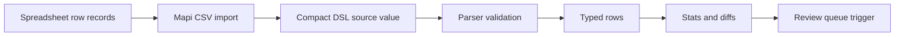

# Broker Workflow

## Manual Workflow

Broker operations teams often normalize venue maps in spreadsheets. A user
collects row labels and physical positions, then manually reconciles gaps,
aliases, and section-specific row naming patterns before publishing or reviewing
inventory.

That workflow is fragile because a spreadsheet row does not encode the domain
rules. Mapi keeps the spreadsheet shape as an input format, then converts it
into a compact DSL value with deterministic parser behavior.

## Before and After

| Step           | Manual Spreadsheet Workflow | Mapi Workflow                         |
| -------------- | --------------------------- | ------------------------------------- |
| Input          | Rows entered by hand        | `section,row,position` records        |
| Validation     | Visual inspection           | Typed row validation                  |
| Gaps           | Manual notes                | Canonical `!` gap slices              |
| Aliases        | Manual convention           | `=` shared-position rows              |
| Downstream use | Copy/paste                  | API response, Redis value, diff input |

## Workflow Diagram



## Example Input

```csv
section,row,position
101,AA,1
101,BB,2
101,CC,3
101,DD,4
101,A,5
101,B,6
101,C,7
101,13,20
101,13W,20
```

Mapi output:

```json
{
  "sections": {
    "101": "AA:DD,A:C,8:19!,13=13W"
  }
}
```
